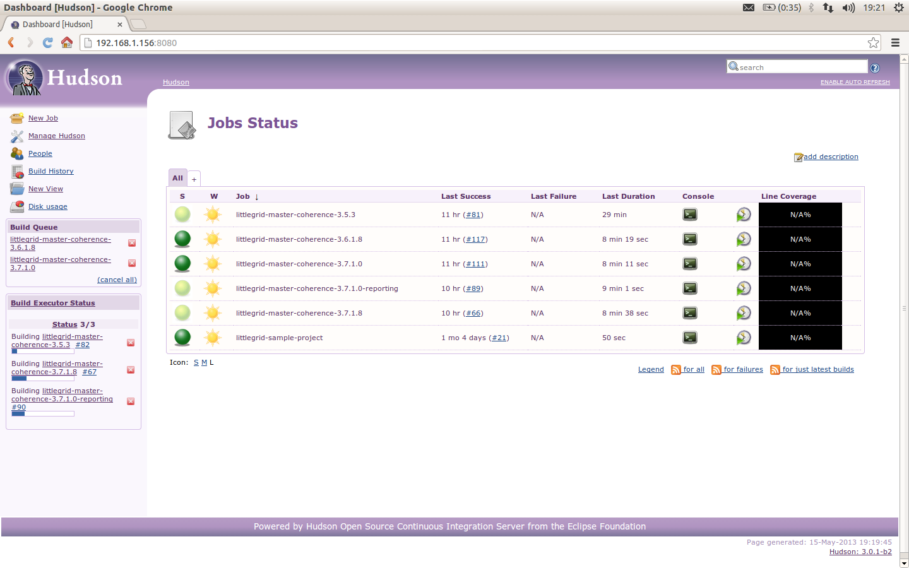
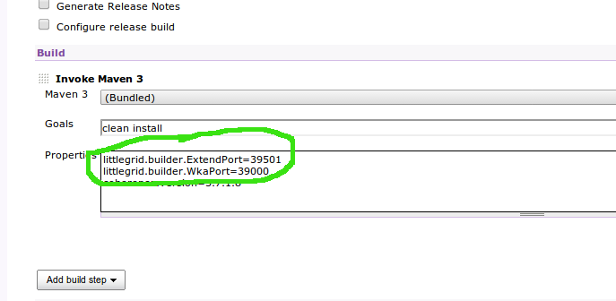

.. index::
   single: Continuous integration

.. _continuous-integration:

Continuous Integration (CI)
===========================

littlegrid was developed using CI for CI, therefore it is very CI friendly.  The technique of running
a cluster in a single process (as used by littlegrid) avoids many of the problems associated with
running a separate process for each cluster member, such as needing to clear up all the processes if
the build breaks or needs to be stopped.

Walking the walking...
----------------------

Here's the new littlegrid CI server (the old server died) - it is configured with 3 individual build
agents and runs on a quad-core Xenon server to ensure that littlegrid works in a highly concurrent
build environment.

.. note:: each commit to the littlegrid Git repository triggers a full build and tests with littlegrid and Coherence 3.5.x, 3.6.x, 3.7.1.x and 12.1.2.x.

How to get started with littlegrid and CI?
------------------------------------------

How do I get started - what do I need to do or configure?

**Single build plan** or **single build agent** servicing many build plans sequentially using littlegrid and Coherence on your CI server or CI agent?

    Cool, you don't need to do anything - littlegrid and Coherence will work just fine with their defaults.

**Multiple concurrent builds** using littlegrid and Coherence on your CI server or CI agent?

    If you have multiple concurrent build plans running on your CI server or CI agent at once then you need to configure littlegrid and essentially Coherence to use different WKA and Extend (if required) ports to avoid the various build plans all clustering together or the Extend ports being already being used - don't worry, it is really straight forward.  The simplest way is to just tell the build agent or CI server to use an Environment variable or System property - here's an example of using a system property:

``-Dlittlegrid.builder.WkaPort=35000``

``-Dlittlegrid.builder.ExtendPort=36000``

If you prefer to use environment variables, then these can be configured like below (in this
example for Windows - note the use of underscores):

``set littlegrid_builder_WkaPort=35000``

``set littlegrid_builder_ExtendPort=36000``

Here's what it looks like when configured on Hudson:

More information is available on the :ref:`builder-to-value-mapping`

That's it, now the build plan that uses these port numbers will avoid using the default littlegrid
port numbers for clustering and running Extend.
