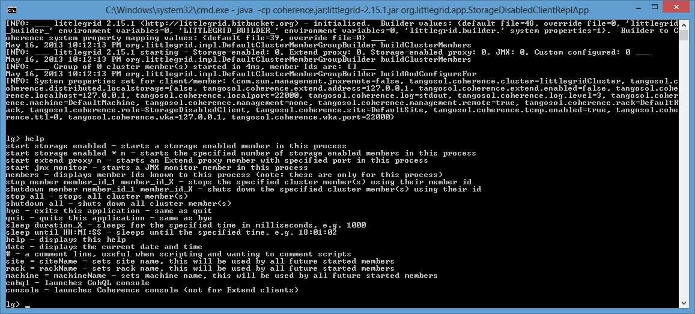
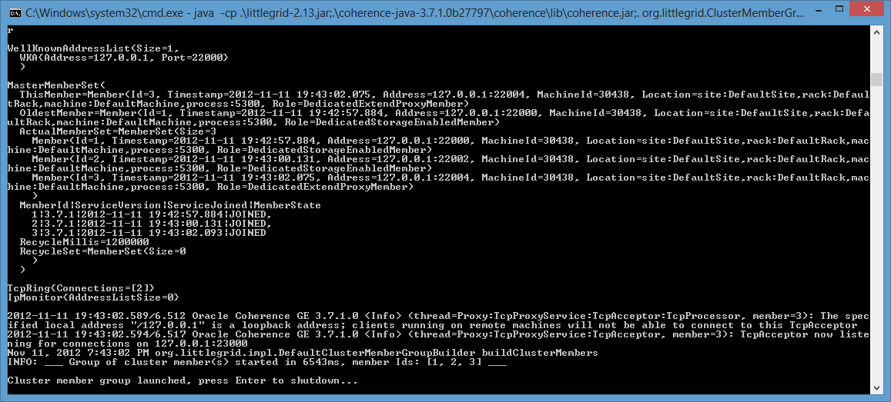

.. index::
   single: DSL; REPL Apps
   single: DSL; Batch command app
   single: C++; REPL and Batch command apps
   single: .Net; REPL and Batch command apps

.. _no-coding-needed:

No coding needed (launch cluster for C++, .Net and easy playing)
================================================================

REPL - try without any Java coding!

littlegrid 2.15 introduced several REPL (Repeat-Evaluate-Print-Loop) consoles and the ability
to perform simple scripting with a simple DSL (Domain-Specific Language).

The easiest way to try the new REPL-DSL console is to use the StorageDisabledClientReplApp, here's
how to launch it - then type ``help`` to display the help information:

    ``java -cp coherence.jar;littlegrid-2.15.2.jar org.littlegrid.app.StorageDisabledClientReplApp``

Here's how to batch up a series of commands that will then execute one after another - in
this case: ``sleep until 22:24:02; stop member 2``

.. image _static/storage-disabled-client-repl-app-after-sleep-stop.png

The REPL console application is a really great way to experiment with Coherence - you can even
invoke the standard Coherence command-line console or CohQL from the REPL console.

The following were added in littlegrid 2.15:

* org.littlegrid.app.StorageDisabledClientReplApp - this application is for running commands as a storage-disabled client

* org.littlegrid.app.ExtendClientReplApp - this application is for running commands as an Extend clients and requires that an Extend client cache configuration file is specified from the command-line:

    ``java -Dlittlegrid.builder.ClientCacheConfiguration=my-extend-cache-config.xml -cp coherence.jar;littlegrid-2.15.2.jar org.littlegrid.app.ExtendClientReplApp``

* org.littlegrid.app.BatchCommandApp - this application is geared up for running commands from a file and is ideal when used with C++ or .Net clients:

    ``java -cp coherence.jar;littlegrid-2.15.2.jar org.littlegrid.app.BatchCommandApp commandFile=simple-commands.txt``

A command file is simply the DSL commands that you wish to execute, for example:

.. code-block:: bash

    start storage enabled

    # this is a comment
    sleep 5000

    start extend proxy 25001

    # check which member exist
    members

    stop member 2

    bye ;

littlegrid also has a very simple launcher, useful if all settings can be passed from the command-line:

The launcher application could be used if you wanted to spawn an entire 'mini-cluster', perhaps
from .Net and then connect to it from your .Net code as an Extend client.  Alternatively, this
technique is useful if you want to connect an application server (such as WebLogic) to a
mini-cluster via Extend.

The launcher can be supplied with an optional simple properties file to be used to control the
cluster configuration, additionally system properties and environment variables can also be used
if required.  Below is an example my-littlegrid.properties:

.. code-block:: bash

    StorageEnabledCount=2
    ExtendProxyCount=1
    FastStartJoinTimeoutMilliseconds=1000

The properties that can be used match the Builder API without the prefix 'set', so these are the same:
``newBuilder().setLogLevel(6)`` is the same as a property LogLevel=6, which is actually the same as
``-Dlittlegrid.builder.LogLevel=6``

To start the launcher, simply have Coherence and littlegrid on your class path.

``java -cp littlegrid-2.15.2.jar;coherence.jar;. org.littlegrid.ClusterMemberGroupApp my-littlegrid.properties``

.. code-block:: bash

    java -Dlittlegrid.builder.StorageEnabledCount=2 -Dlittlegrid.builder.ExtendProxyCount=1 \
                -Dlittlegrid.builder.FastStartJoinTimeoutMilliseconds=1000 \
                -cp littlegrid-2.15.2.jar;coherence.jar;. org.littlegrid.ClusterMemberGroupApp

